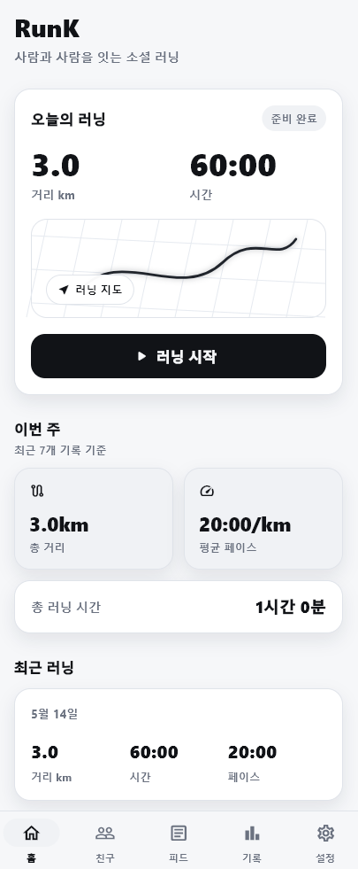
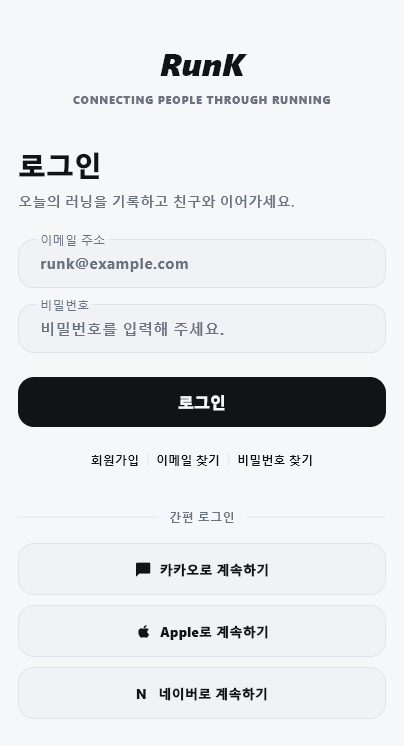
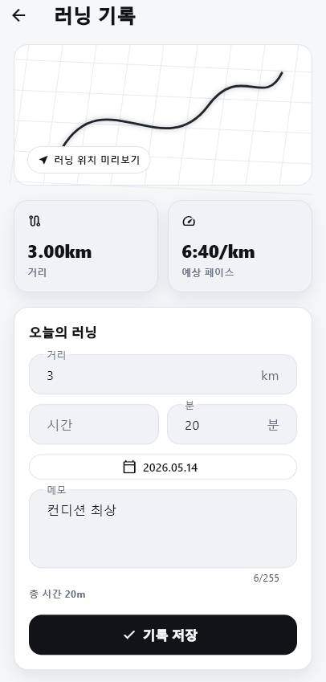
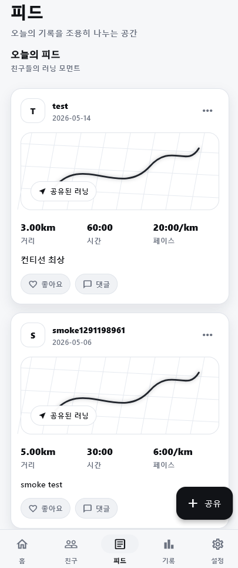
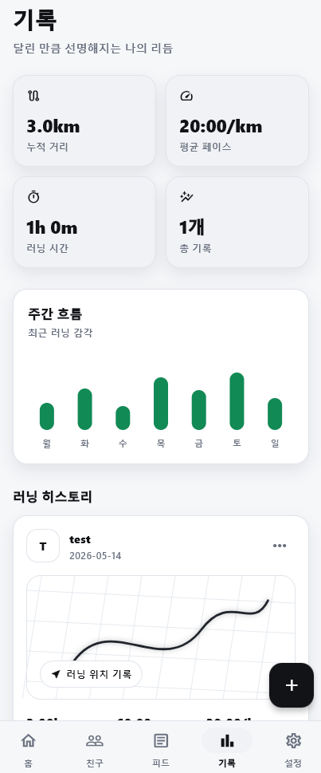

# RunK

RunK는 러닝 기록을 저장하고 피드로 공유할 수 있는 소셜 러닝 앱 MVP입니다. Flutter 앱 화면과 FastAPI 백엔드를 연결해 회원가입/로그인, JWT 기반 세션 복원, 러닝 기록 저장, 피드 조회 흐름을 구현했습니다.

> 네이버 지도 API 기반 실제 GPS 경로 기록은 구현 예정 기능이며, 현재 화면의 지도/경로 이미지는 UI 미리보기용입니다.

## 프로젝트 요약

- **프로젝트 유형**: 소셜 러닝 모바일 앱
- **Frontend**: Flutter, Dart
- **Backend**: FastAPI, REST API
- **Database**: MySQL
- **인증**: JWT 기반 로그인/세션 복원

## 핵심 기능

1. 이메일 기반 회원가입/로그인
2. JWT 세션 복원 및 사용자 정보 조회
3. 러닝 거리/시간/페이스 기록 저장
4. 피드에서 러닝 기록 조회
5. 홈, 기록, 피드, 히스토리, 설정 중심의 모바일 UI 구성

## 담당 역할

- Flutter 앱 화면 구현
- FastAPI 백엔드 API 설계
- Flutter MVVM 구조와 REST API 연동
- MySQL 기반 데이터 저장 구조 구성

## 기술 스택

| 영역 | 기술 |
| --- | --- |
| App | Flutter, Dart |
| Backend | FastAPI, Pydantic |
| Database | MySQL |
| API | REST API |
| Auth | JWT |
| Tooling | Docker Compose, PowerShell |

## 화면

| 홈 | 로그인 |
| --- | --- |
|  |  |

| 기록 저장 | 피드 | 히스토리 |
| --- | --- | --- |
|  |  |  |

## 실행 방법

### 1. MySQL 실행

```powershell
.\scripts\start-db.ps1
```

### 2. 백엔드 실행

```powershell
.\scripts\start-backend.ps1
```

### 3. Flutter 앱 실행

```powershell
cd frontend
flutter pub get
flutter run
```

Android Emulator에서 로컬 백엔드에 접근할 경우:

```powershell
flutter run -d <device-id> --dart-define=API_BASE_URL=http://10.0.2.2:8000
```

## API 요약

| Method | Path | 설명 | Auth |
| --- | --- | --- | --- |
| GET | `/health` | 서버 상태 확인 | No |
| POST | `/auth/signup` | 회원가입 | No |
| POST | `/auth/login` | 로그인 | No |
| GET | `/users/me` | 내 정보 조회 | Yes |
| POST | `/running-records` | 러닝 기록 생성 | Yes |
| GET | `/running-records/me` | 내 러닝 기록 조회 | Yes |
| GET | `/feed?limit=50` | 최신 피드 조회 | No |

## 현재 구현 범위

구현 완료:

- 회원가입/로그인
- JWT 세션 복원
- 러닝 기록 저장
- 내 기록 및 피드 조회
- 홈/친구/피드/기록/설정 탭 구조
- 모바일 앱 UI 및 백엔드 API 연동

추가 예정:

- 실제 GPS 경로 저장
- 네이버 지도 API 기반 경로 시각화
- 친구 관계 DB/API
- 좋아요/댓글
- Android 실기기 검증 및 배포 환경 구성
